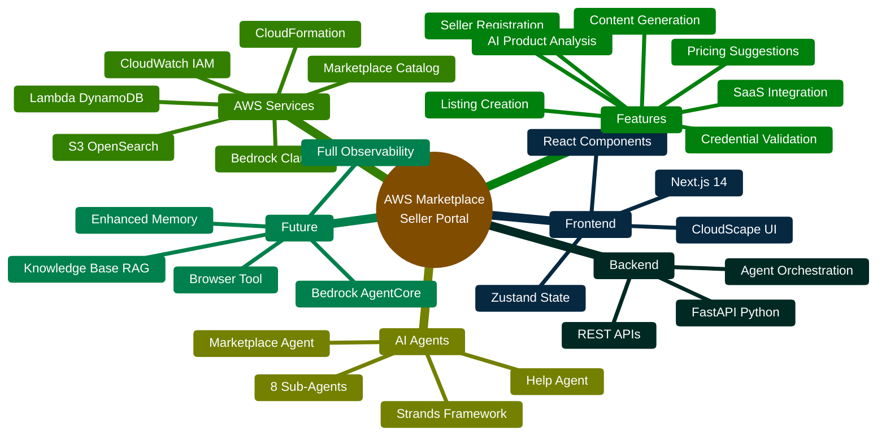
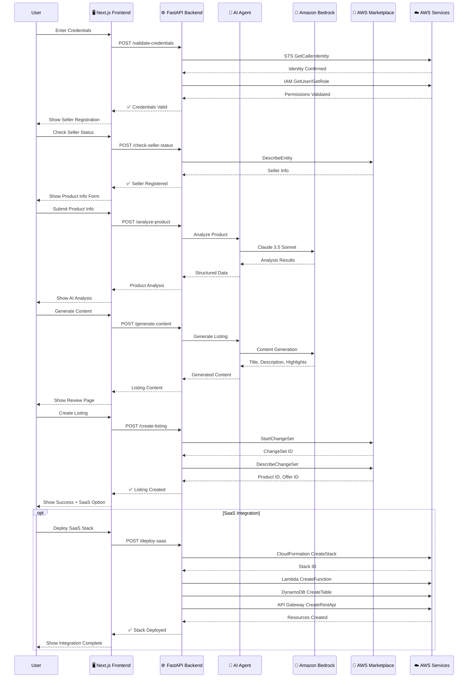
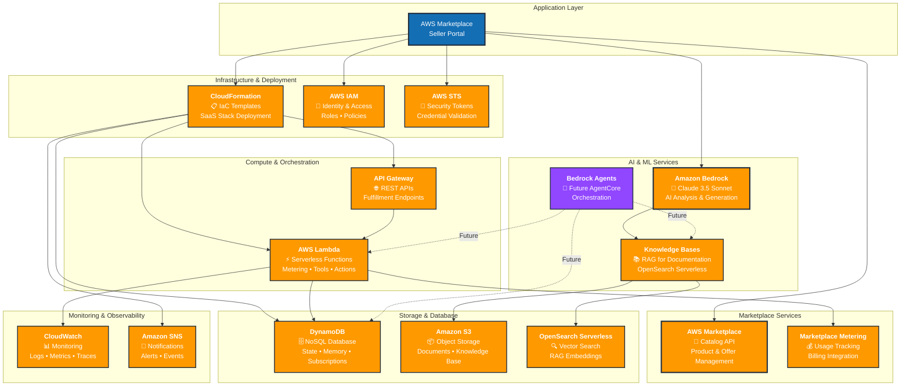
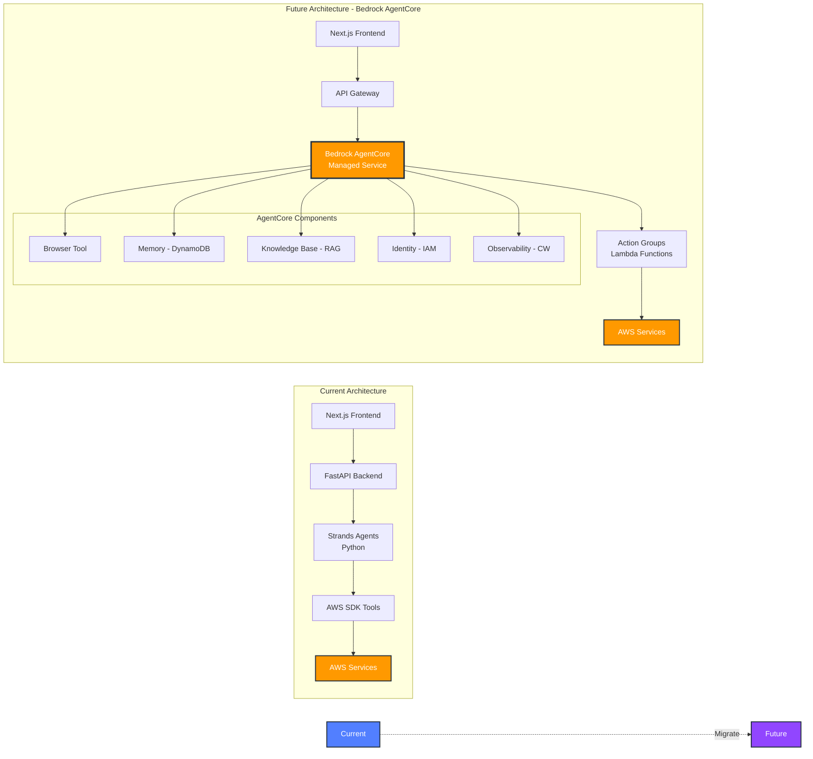
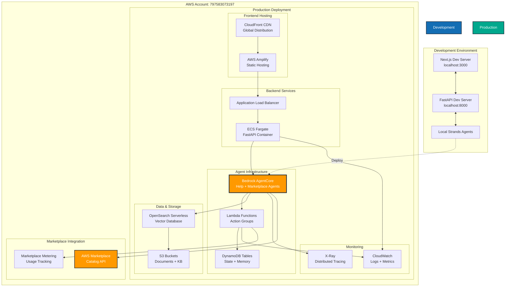
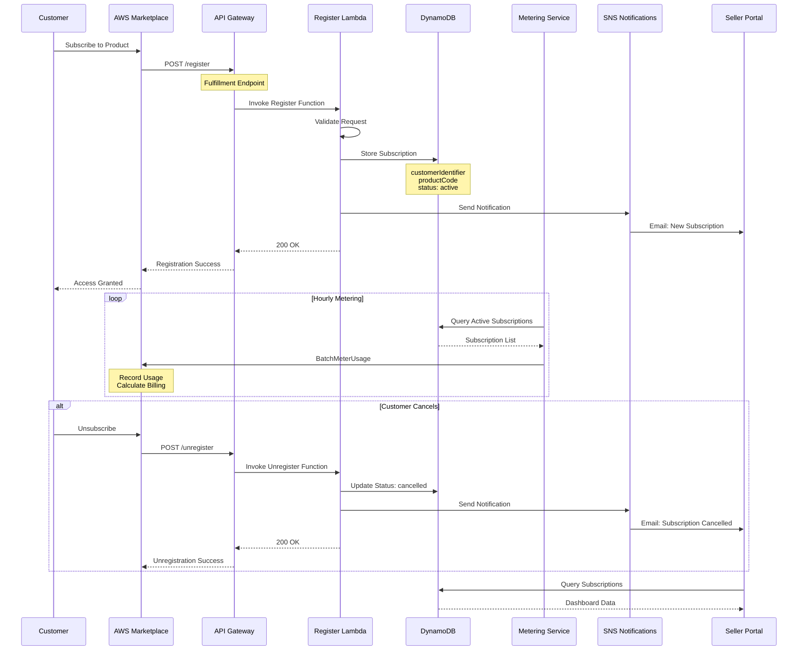

<div align="center">
  <div>
    
  </div>

  <h1>
    AWS Marketplace Seller Portal
  </h1>

  <h2>
    AI-powered product listing creation and management - using Amazon Bedrock AgentCore
  </h2>

  <div align="center">
    <a href="https://github.com/yourusername/aws-marketplace-seller-portal/graphs/commit-activity"></a>
    <a href="https://github.com/yourusername/aws-marketplace-seller-portal/issues"></a>
    <a href="https://github.com/yourusername/aws-marketplace-seller-portal/pulls"></a>
    <a href="https://github.com/yourusername/aws-marketplace-seller-portal/blob/main/LICENSE"></a>
  </div>
  
  <p>
    <a href="#-architecture">Architecture</a>
    ◆ <a href="#-quick-start">Quick Start</a>
    ◆ <a href="./docs/">Documentation</a>
    ◆ <a href="./deployment/bedrock-agentcore/">AgentCore Deployment</a>
  </p>
</div>

---

Welcome to the AWS Marketplace Seller Portal!

A modern, AI-powered web application that helps AWS Marketplace sellers create and manage product listings with intelligent automation. Built with **Next.js 14**, **FastAPI**, and **Amazon Bedrock**, this portal streamlines the entire listing workflow from credential validation to SaaS integration.

Whether you're creating your first product listing or managing multiple SaaS offerings, this portal provides AI-powered analysis, content generation, and automated infrastructure deployment—all integrated with AWS Marketplace Catalog API and Amazon Bedrock AgentCore.

## 🎥 Demo

> Coming soon: Video walkthrough of the complete workflow from credentials to deployed SaaS product

## 📁 Repository Structure

### 🖥️ [`frontend/`](./frontend/)
**Next.js 14 Application with CloudScape UI**

Modern React application using Next.js App Router, AWS CloudScape Design System, and TypeScript for type-safe development.

- **Pages**: 7-stage workflow (Credentials → Seller Registration → Product Info → AI Analysis → Review → Create Listing → SaaS Integration)
- **Components**: Reusable UI components (GlobalHeader, WorkflowNav, ProgressBar, Chatbot)
- **State Management**: Zustand store for session, workflow, and user data
- **Styling**: AWS-themed with orange accent colors and gradient backgrounds

### ⚙️ [`backend/`](./backend/)
**FastAPI Python Backend**

High-performance REST API server handling AWS service integrations and agent orchestration.

- **API Endpoints**: 9 endpoints for credentials, seller status, product analysis, content generation, pricing, listing creation, and SaaS deployment
- **AWS Integration**: Boto3 SDK for Bedrock, Marketplace Catalog, CloudFormation, IAM, STS, DynamoDB, Lambda
- **Agent Orchestration**: Manages Strands-based AI agents for intelligent automation

### 🤖 [`reference/streamlit-app/agent/`](./reference/streamlit-app/agent/)
**AI Agent System - Strands Framework**

Intelligent agents powered by Amazon Bedrock Claude 3.5 Sonnet for automated listing creation and help.

- **Help Agent**: Documentation search, troubleshooting, and guided assistance
- **Marketplace Agent**: Orchestrates 8 sub-agents for end-to-end listing workflow
- **Orchestrator**: Manages workflow state and agent coordination
- **Sub-Agents**: Specialized agents for each workflow stage
- **Tools Layer**: AWS service wrappers for Marketplace, CloudFormation, IAM, etc.

### 📦 [`deployment/bedrock-agentcore/`](./deployment/bedrock-agentcore/)
**Amazon Bedrock AgentCore Deployment**

Production-ready deployment scripts and configuration for migrating to Bedrock AgentCore managed infrastructure.

- **Scripts**: Automated deployment for Runtime, Gateway, Memory, Identity, Tools, and Observability
- **Configuration**: Infrastructure as Code (IaC) templates and settings
- **Documentation**: Migration guides, component details, and quick start

### 📚 [`docs/`](./docs/)
**Comprehensive Documentation**

Detailed guides covering architecture, implementation, and migration strategies.

- **Architecture**: Agent design, component breakdown, and system diagrams
- **Implementation**: Feature guides for chatbot, SaaS integration, AWS theme
- **Migration**: Bedrock AgentCore migration path and component mapping

## ✨ Features

### 🎯 Core Capabilities

| Feature | Description |
|---------|-------------|
| **AI-Powered Product Analysis** | Analyze product websites and documentation using Amazon Bedrock Claude 3.5 Sonnet |
| **Intelligent Content Generation** | Auto-generate listing titles, descriptions, and highlights with AI |
| **Smart Pricing Recommendations** | Get AI-suggested pricing models, dimensions, and contract durations |
| **Real-Time CloudFormation Monitoring** | Track SaaS infrastructure deployment with live status updates |
| **Seller Registration Management** | Automated seller status validation and marketplace access verification |
| **Complete Listing Workflow** | End-to-end product listing creation with 7-stage guided process |
| **SaaS Integration** | One-click CloudFormation deployment for serverless SaaS infrastructure |
| **AI Help Assistant** | Floating chatbot with AWS Marketplace documentation knowledge base |

### 🛠️ Technical Stack

| Layer | Technologies |
|-------|-------------|
| **Frontend** | Next.js 14, React 18, TypeScript, AWS CloudScape Design System, Zustand |
| **Backend** | FastAPI, Python 3.13, Uvicorn, Pydantic, Boto3 |
| **AI/ML** | Amazon Bedrock (Claude 3.5 Sonnet), Strands Agents Framework |
| **AWS Services** | Marketplace Catalog, CloudFormation, Lambda, DynamoDB, S3, OpenSearch, IAM, STS, CloudWatch |
| **Future** | Bedrock AgentCore (Runtime, Gateway, Memory, Identity, Tools, Observability) |

## 🚀 Quick Start

### Prerequisites

- An [AWS account](https://signin.aws.amazon.com/signin) with credentials configured (`aws configure`)
- [Node.js 18+](https://nodejs.org/) and npm
- [Python 3.13+](https://www.python.org/downloads/)
- Model Access: Anthropic Claude 3.5 Sonnet enabled in [Amazon Bedrock console](https://docs.aws.amazon.com/bedrock/latest/userguide/model-access-modify.html)
- AWS Permissions:
  - `AWSMarketplaceFullAccess` managed policy
  - `AmazonBedrockFullAccess` managed policy
  - `CloudFormationFullAccess` for SaaS deployment
  - `IAMFullAccess` for role creation
  - See detailed permissions in [Configuration](#-configuration)

### Step 1: Clone and Install

```bash
# Clone the repository
git clone <repository-url>
cd aws-marketplace-seller-portal

# Backend setup
python3 -m venv venv
source venv/bin/activate  # On Windows: venv\Scripts\activate
pip install -r requirements.txt

# Frontend setup
cd frontend
npm install
cd ..
```

### Step 2: Configure AWS Credentials

```bash
# Configure AWS CLI (if not already done)
aws configure

# Or export credentials directly
export AWS_ACCESS_KEY_ID=your_access_key
export AWS_SECRET_ACCESS_KEY=your_secret_key
export AWS_DEFAULT_REGION=us-east-1
```

### Step 3: Start the Application

```bash
# Terminal 1: Start Backend (from project root)
cd backend
../venv/bin/uvicorn main:app --host 0.0.0.0 --port 8000

# Terminal 2: Start Frontend (from project root)
cd frontend
npm run dev
```

**Success!** 
- Backend: `http://localhost:8000`
- Frontend: `http://localhost:3000`
- API Docs: `http://localhost:8000/docs`

### Step 4: Create Your First Listing

1. **Enter AWS Credentials** - Validate your AWS access
2. **Check Seller Status** - Verify marketplace registration
3. **Add Product Info** - Provide website and documentation
4. **AI Analysis** - Let Bedrock analyze your product
5. **Generate Content** - Auto-create listing content
6. **Review & Price** - Configure pricing and terms
7. **Create Listing** - Submit to AWS Marketplace
8. **Deploy SaaS** (Optional) - One-click infrastructure deployment

Congratulations! Your product listing is now live on AWS Marketplace!

## 📖 Workflow Guide

The portal guides you through a 7-stage workflow to create and deploy AWS Marketplace listings:

| Stage | Description | AWS Services |
|-------|-------------|--------------|
| **1. Credentials** | Validate AWS access keys and permissions | AWS STS, IAM |
| **2. Seller Registration** | Check marketplace seller status and account info | AWS Marketplace Catalog API |
| **3. Product Information** | Provide product details, website, and documentation | User Input |
| **4. AI Analysis** | AI analyzes product and extracts key features | Amazon Bedrock (Claude 3.5) |
| **5. Content Generation** | Auto-generate title, description, and highlights | Amazon Bedrock + Agents |
| **6. Review & Pricing** | Configure pricing model, dimensions, and terms | Sub-Agents |
| **7. Create Listing** | Submit to AWS Marketplace and get Product/Offer IDs | Marketplace Catalog API |
| **8. SaaS Integration** | Deploy serverless infrastructure (optional) | CloudFormation, Lambda, DynamoDB |

Each stage includes validation, error handling, and the ability to go back and modify previous steps.

## 🏗️ Architecture

### Architecture at a Glance



### System Architecture Diagram

```mermaid
graph TB
    subgraph "Frontend Layer - Next.js 14 + CloudScape UI"
        UI[🖥️ User Interface]
        Header[GlobalHeader]
        Nav[WorkflowNav]
        Progress[ProgressBar]
        Chat[Chatbot]
        Pages[Page Components<br/>Credentials • Seller Reg<br/>Product Info • AI Analysis<br/>Review • Create Listing<br/>SaaS Integration]
        Store[Zustand State Store]
        
        UI --> Header
        UI --> Nav
        UI --> Progress
        UI --> Chat
        UI --> Pages
        Pages --> Store
    end
    
    subgraph "Backend Layer - FastAPI Python"
        API[🔌 REST API Endpoints<br/>localhost:8000]
        Validate[/validate-credentials]
        CheckSeller[/check-seller-status]
        Analyze[/analyze-product]
        Generate[/generate-content]
        Pricing[/suggest-pricing]
        CreateList[/create-listing]
        DeploySaaS[/deploy-saas]
        StackStatus[/get-stack-status]
        ChatAPI[/chat]
        
        API --> Validate
        API --> CheckSeller
        API --> Analyze
        API --> Generate
        API --> Pricing
        API --> CreateList
        API --> DeploySaaS
        API --> StackStatus
        API --> ChatAPI
    end
    
    subgraph "Agent Layer - Strands Framework"
        HelpAgent[🤖 Help Agent<br/>Doc Search • Troubleshoot • Guides]
        MPAgent[🤖 Marketplace Agent<br/>Orchestrator • Sub-Agents • Tools]
        Orchestrator[Workflow Orchestrator<br/>8 Stage Management]
        SubAgents[Sub-Agents<br/>Stage-Specific Logic]
        
        HelpAgent --> Orchestrator
        MPAgent --> Orchestrator
        Orchestrator --> SubAgents
    end
    
    subgraph "Future: Bedrock AgentCore"
        AgentCore[🔮 AgentCore Migration]
        HelpAgentCore[Help Agent<br/>Browser • Memory • KB • IAM]
        MPAgentCore[Marketplace Agent<br/>Action Groups • Lambda • State]
        
        AgentCore --> HelpAgentCore
        AgentCore --> MPAgentCore
    end
    
    subgraph "Tools Layer - AWS Service Integrations"
        SellerTools[Seller Registration Tools<br/>Check Status • Validate Perms]
        ListingTools[Listing Tools<br/>Create • Delivery • Pricing • Publish]
        SaaSTools[SaaS Integration Tools<br/>Deploy Stack • Monitor CFN]
    end
    
    subgraph "AWS Services Layer"
        Bedrock[<br/>Amazon Bedrock<br/>Claude 3.5 Sonnet]
        Marketplace[<br/>AWS Marketplace<br/>Catalog API]
        CFN[<br/>CloudFormation<br/>Infrastructure]
        DDB[<br/>DynamoDB<br/>State & Memory]
        Lambda[<br/>AWS Lambda<br/>Serverless Functions]
        S3[<br/>Amazon S3<br/>Document Storage]
        OpenSearch[<br/>OpenSearch<br/>Vector Search]
        CloudWatch[<br/>CloudWatch<br/>Monitoring]
        IAM[<br/>AWS IAM<br/>Identity]
        STS[<br/>AWS STS<br/>Credentials]
        APIGateway[<br/>API Gateway<br/>REST APIs]
        SNS[<br/>Amazon SNS<br/>Notifications]
    end
    
    %% Connections
    Pages -->|HTTP/REST| API
    API --> HelpAgent
    API --> MPAgent
    
    SubAgents --> SellerTools
    SubAgents --> ListingTools
    SubAgents --> SaaSTools
    
    SellerTools --> Marketplace
    SellerTools --> IAM
    SellerTools --> STS
    
    ListingTools --> Marketplace
    ListingTools --> Bedrock
    
    SaaSTools --> CFN
    SaaSTools --> Lambda
    SaaSTools --> DDB
    SaaSTools --> APIGateway
    SaaSTools --> SNS
    
    HelpAgent --> Bedrock
    MPAgent --> Bedrock
    
    Bedrock --> S3
    Bedrock --> OpenSearch
    
    CFN --> CloudWatch
    Lambda --> CloudWatch
    DDB --> CloudWatch
    
    %% Future migration
    MPAgent -.->|Migrate to| AgentCore
    HelpAgent -.->|Migrate to| AgentCore
    
    style Bedrock fill:#FF9900,stroke:#232F3E,stroke-width:2px,color:#fff
    style Marketplace fill:#FF9900,stroke:#232F3E,stroke-width:2px,color:#fff
    style CFN fill:#FF9900,stroke:#232F3E,stroke-width:2px,color:#fff
    style DDB fill:#FF9900,stroke:#232F3E,stroke-width:2px,color:#fff
    style Lambda fill:#FF9900,stroke:#232F3E,stroke-width:2px,color:#fff
    style S3 fill:#FF9900,stroke:#232F3E,stroke-width:2px,color:#fff
    style OpenSearch fill:#FF9900,stroke:#232F3E,stroke-width:2px,color:#fff
    style CloudWatch fill:#FF9900,stroke:#232F3E,stroke-width:2px,color:#fff
    style IAM fill:#FF9900,stroke:#232F3E,stroke-width:2px,color:#fff
    style STS fill:#FF9900,stroke:#232F3E,stroke-width:2px,color:#fff
    style APIGateway fill:#FF9900,stroke:#232F3E,stroke-width:2px,color:#fff
    style SNS fill:#FF9900,stroke:#232F3E,stroke-width:2px,color:#fff
    style AgentCore fill:#9146FF,stroke:#232F3E,stroke-width:2px,color:#fff
```

### High-Level Architecture Overview

```mermaid
flowchart LR
    User([👤 User])
    
    subgraph Frontend["🖥️ Frontend - Next.js 14"]
        UI[CloudScape UI Components]
    end
    
    subgraph Backend["⚙️ Backend - FastAPI"]
        API[REST API Endpoints]
    end
    
    subgraph Agents["🤖 AI Agents - Strands"]
        Help[Help Agent]
        MP[Marketplace Agent]
    end
    
    subgraph AWS["☁️ AWS Services"]
        direction TB
        Bedrock[Amazon Bedrock<br/>Claude 3.5]
        Market[AWS Marketplace<br/>Catalog]
        Infra[CloudFormation<br/>Lambda • DynamoDB<br/>S3 • OpenSearch]
    end
    
    User <-->|HTTPS| Frontend
    Frontend <-->|REST API| Backend
    Backend <--> Agents
    Agents <--> AWS
    
    style Frontend fill:#146EB4,stroke:#232F3E,stroke-width:3px,color:#fff
    style Backend fill:#527FFF,stroke:#232F3E,stroke-width:3px,color:#fff
    style Agents fill:#01A88D,stroke:#232F3E,stroke-width:3px,color:#fff
    style AWS fill:#FF9900,stroke:#232F3E,stroke-width:3px,color:#fff
```



### Data Flow Architecture



### Workflow Stages with AWS Services

```mermaid
graph LR
    Start([🚀 Start])
    
    Stage1[1️⃣ Credentials<br/>Validation]
    Stage2[2️⃣ Seller<br/>Registration]
    Stage3[3️⃣ Product<br/>Information]
    Stage4[4️⃣ AI<br/>Analysis]
    Stage5[5️⃣ Content<br/>Generation]
    Stage6[6️⃣ Review &<br/>Pricing]
    Stage7[7️⃣ Create<br/>Listing]
    Stage8[8️⃣ SaaS<br/>Integration]
    
    End([✅ Complete])
    
    Start --> Stage1
    Stage1 -->|STS + IAM| Stage2
    Stage2 -->|Marketplace API| Stage3
    Stage3 -->|User Input| Stage4
    Stage4 -->|Bedrock Claude| Stage5
    Stage5 -->|Bedrock + Agent| Stage6
    Stage6 -->|Sub-Agents| Stage7
    Stage7 -->|Marketplace API| Stage8
    Stage8 -->|CloudFormation| End
    
    Stage1 -.->|AWS STS<br/>IAM| STS[🔐 Credentials]
    Stage2 -.->|Marketplace<br/>Catalog| MP[🏪 Seller Check]
    Stage4 -.->|Claude 3.5<br/>Sonnet| BR[🧠 AI Analysis]
    Stage5 -.->|Bedrock<br/>Agent| BR2[🧠 Content Gen]
    Stage7 -.->|StartChangeSet<br/>DescribeChangeSet| MP2[🏪 Create Product]
    Stage8 -.->|CreateStack<br/>Lambda • DDB| CFN[📦 Infrastructure]
    
    style Stage1 fill:#146EB4,stroke:#232F3E,stroke-width:2px,color:#fff
    style Stage2 fill:#146EB4,stroke:#232F3E,stroke-width:2px,color:#fff
    style Stage3 fill:#146EB4,stroke:#232F3E,stroke-width:2px,color:#fff
    style Stage4 fill:#01A88D,stroke:#232F3E,stroke-width:2px,color:#fff
    style Stage5 fill:#01A88D,stroke:#232F3E,stroke-width:2px,color:#fff
    style Stage6 fill:#01A88D,stroke:#232F3E,stroke-width:2px,color:#fff
    style Stage7 fill:#527FFF,stroke:#232F3E,stroke-width:2px,color:#fff
    style Stage8 fill:#527FFF,stroke:#232F3E,stroke-width:2px,color:#fff
    style STS fill:#FF9900,stroke:#232F3E,stroke-width:2px,color:#fff
    style MP fill:#FF9900,stroke:#232F3E,stroke-width:2px,color:#fff
    style BR fill:#FF9900,stroke:#232F3E,stroke-width:2px,color:#fff
    style BR2 fill:#FF9900,stroke:#232F3E,stroke-width:2px,color:#fff
    style MP2 fill:#FF9900,stroke:#232F3E,stroke-width:2px,color:#fff
    style CFN fill:#FF9900,stroke:#232F3E,stroke-width:2px,color:#fff
```



### Component Architecture

```mermaid
graph TB
    subgraph "Frontend Components"
        Layout[App Layout<br/>layout.tsx]
        Header[GlobalHeader<br/>AWS Branding]
        Nav[WorkflowNav<br/>7 Stages]
        Progress[ProgressBar<br/>Visual Tracking]
        Chat[Chatbot<br/>Floating Help]
        
        Layout --> Header
        Layout --> Nav
        Layout --> Progress
        Layout --> Chat
        
        subgraph "Pages"
            P1[Credentials<br/>page.tsx]
            P2[Seller Registration<br/>seller-registration/]
            P3[Product Info<br/>product-info/]
            P4[AI Analysis<br/>ai-analysis/]
            P5[Review<br/>review-suggestions/]
            P6[Create Listing<br/>create-listing/]
            P7[SaaS Integration<br/>saas-integration/]
        end
        
        Layout --> Pages
    end
    
    subgraph "State Management"
        Store[Zustand Store]
        Session[Session State]
        Workflow[Workflow State]
        User[User Data]
        
        Store --> Session
        Store --> Workflow
        Store --> User
    end
    
    subgraph "Backend Services"
        FastAPI[FastAPI Server<br/>main.py]
        
        subgraph "Endpoints"
            E1[/validate-credentials]
            E2[/check-seller-status]
            E3[/analyze-product]
            E4[/generate-content]
            E5[/suggest-pricing]
            E6[/create-listing]
            E7[/deploy-saas]
            E8[/get-stack-status]
            E9[/chat]
        end
        
        FastAPI --> Endpoints
    end
    
    subgraph "Agent System"
        Help[Help Agent<br/>marketplace_help_agent.py]
        MP[Marketplace Agent<br/>strands_marketplace_agent.py]
        Orch[Orchestrator<br/>orchestrator.py]
        
        subgraph "Sub-Agents"
            SA1[Credentials Agent]
            SA2[Seller Agent]
            SA3[Product Agent]
            SA4[Analysis Agent]
            SA5[Content Agent]
            SA6[Pricing Agent]
            SA7[Listing Agent]
            SA8[SaaS Agent]
        end
        
        MP --> Orch
        Orch --> Sub-Agents
    end
    
    Pages -->|API Calls| FastAPI
    FastAPI --> Help
    FastAPI --> MP
    Pages <--> Store
    
    style Layout fill:#146EB4,stroke:#232F3E,stroke-width:2px,color:#fff
    style Store fill:#527FFF,stroke:#232F3E,stroke-width:2px,color:#fff
    style FastAPI fill:#01A88D,stroke:#232F3E,stroke-width:2px,color:#fff
    style MP fill:#9146FF,stroke:#232F3E,stroke-width:2px,color:#fff
```

### AWS Services Integration



### Directory Structure

```
ai-agent-marketplace/
├── frontend/                    # Next.js 14 Application
│   ├── src/
│   │   ├── app/                # App Router Pages
│   │   │   ├── page.tsx        # Credentials
│   │   │   ├── seller-registration/
│   │   │   ├── product-info/
│   │   │   ├── ai-analysis/
│   │   │   ├── review-suggestions/
│   │   │   ├── create-listing/
│   │   │   └── saas-integration/
│   │   ├── components/         # Reusable Components
│   │   │   ├── GlobalHeader.tsx
│   │   │   ├── WorkflowNav.tsx
│   │   │   ├── ProgressBar.tsx
│   │   │   └── Chatbot.tsx
│   │   ├── lib/               # Utilities
│   │   │   └── store.ts       # Zustand State
│   │   └── types/             # TypeScript Types
│   └── package.json
│
├── backend/                    # FastAPI Backend
│   └── main.py                # API Endpoints
│
├── reference/streamlit-app/   # Agent Implementation
│   ├── agent/                 # Strands Agents
│   │   ├── strands_marketplace_agent.py
│   │   ├── marketplace_help_agent.py
│   │   ├── orchestrator.py
│   │   ├── sub_agents/        # 8 Workflow Sub-Agents
│   │   └── tools/             # AWS Service Tools
│   └── agents/                # Specialized Agents
│       ├── serverless_saas_integration.py
│       └── workflow_orchestrator.py
│
├── deployment/                # Deployment Scripts
│   └── bedrock-agentcore/    # AgentCore Deployment
│       ├── scripts/          # Automated Deployment
│       └── config/           # Configuration
│
└── docs/                      # Documentation
    ├── AGENT_ARCHITECTURE.md
    ├── BEDROCK_AGENTCORE_MIGRATION.md
    ├── BEDROCK_AGENTCORE_COMPONENTS.md
    └── *.md
```

### Key Components

#### Frontend Components
- **GlobalHeader**: AWS-themed navigation with account info
- **WorkflowNav**: Sidebar showing workflow stages and progress
- **ProgressBar**: Visual progress indicator
- **Chatbot**: Floating help assistant (Help Agent)

#### Backend Services
- **FastAPI Server**: REST API endpoints
- **Agent Orchestration**: Manages agent lifecycle
- **Tool Execution**: AWS service integrations

#### Agent System
- **Help Agent**: Documentation Q&A and troubleshooting
- **Marketplace Agent**: Product listing orchestration
- **Orchestrator**: Workflow state management
- **Sub-Agents**: Stage-specific logic (8 stages)
- **Tools Layer**: AWS API wrappers

#### AWS Services
- **Bedrock**: LLM (Claude 3.5 Sonnet) + Agents
- **Marketplace Catalog**: Product/offer management
- **CloudFormation**: Infrastructure deployment
- **DynamoDB**: State and memory storage
- **Lambda**: Serverless tool execution
- **S3**: Document storage
- **OpenSearch**: Vector search for RAG
- **CloudWatch**: Monitoring and logging

### Migration Path to Bedrock AgentCore



**Current Architecture**: FastAPI → Strands Agents → AWS APIs  
**Future Architecture**: API Gateway → Bedrock AgentCore → Lambda Tools → AWS APIs

**Benefits of Migration**:
- ✅ Fully managed agent infrastructure
- ✅ Built-in memory and state management
- ✅ Native browser tool integration
- ✅ Integrated knowledge base with RAG
- ✅ Enhanced observability and monitoring
- ✅ Reduced operational overhead
- ✅ Better scalability and reliability

See [deployment/bedrock-agentcore/](./deployment/bedrock-agentcore/) for deployment guide.

### Deployment Architecture



### SaaS Integration Architecture

```mermaid
graph TB
    subgraph "AWS Marketplace"
        Buyer[Customer/Buyer]
        MPConsole[Marketplace Console]
        MPSubscribe[Subscribe to Product]
    end
    
    subgraph "SaaS Product Infrastructure - CloudFormation Stack"
        direction TB
        
        subgraph "API Layer"
            APIGW[API Gateway<br/>Fulfillment API]
            RegisterEP[/register endpoint]
            UnregisterEP[/unregister endpoint]
        end
        
        subgraph "Compute Layer"
            RegisterLambda[Register Lambda<br/>New Subscription Handler]
            UnregisterLambda[Unregister Lambda<br/>Cancellation Handler]
            MeteringLambda[Metering Lambda<br/>Usage Reporting]
        end
        
        subgraph "Data Layer"
            DDBTable[DynamoDB Table<br/>Subscriptions]
            Attributes[customerIdentifier<br/>productCode<br/>subscriptionStatus<br/>timestamp]
        end
        
        subgraph "Monitoring"
            CWLogs[CloudWatch Logs<br/>Lambda Execution]
            CWMetrics[CloudWatch Metrics<br/>Subscription Stats]
            SNSTopic[SNS Topic<br/>Alerts & Notifications]
        end
        
        APIGW --> RegisterEP
        APIGW --> UnregisterEP
        RegisterEP --> RegisterLambda
        UnregisterEP --> UnregisterLambda
        
        RegisterLambda --> DDBTable
        UnregisterLambda --> DDBTable
        MeteringLambda --> DDBTable
        
        RegisterLambda --> CWLogs
        UnregisterLambda --> CWLogs
        MeteringLambda --> CWLogs
        
        DDBTable --> CWMetrics
        RegisterLambda --> SNSTopic
        UnregisterLambda --> SNSTopic
    end
    
    subgraph "AWS Marketplace Services"
        MPMetering[Marketplace Metering API<br/>Usage Records]
        MPEntitlement[Marketplace Entitlement<br/>Access Control]
    end
    
    subgraph "Seller Portal"
        Portal[Seller Portal UI]
        Monitor[Real-time Monitoring<br/>Stack Status]
        Dashboard[Subscription Dashboard]
    end
    
    Buyer --> MPConsole
    MPConsole --> MPSubscribe
    MPSubscribe -->|POST /register| APIGW
    
    MeteringLambda -->|BatchMeterUsage| MPMetering
    RegisterLambda --> MPEntitlement
    
    Portal --> Monitor
    Monitor -->|DescribeStacks| CloudFormation[CloudFormation API]
    Dashboard -->|Scan| DDBTable
    
    style APIGW fill:#FF9900,stroke:#232F3E,stroke-width:2px,color:#fff
    style RegisterLambda fill:#FF9900,stroke:#232F3E,stroke-width:2px,color:#fff
    style UnregisterLambda fill:#FF9900,stroke:#232F3E,stroke-width:2px,color:#fff
    style MeteringLambda fill:#FF9900,stroke:#232F3E,stroke-width:2px,color:#fff
    style DDBTable fill:#FF9900,stroke:#232F3E,stroke-width:2px,color:#fff
    style CWLogs fill:#FF9900,stroke:#232F3E,stroke-width:2px,color:#fff
    style SNSTopic fill:#FF9900,stroke:#232F3E,stroke-width:2px,color:#fff
    style MPMetering fill:#FF9900,stroke:#232F3E,stroke-width:2px,color:#fff
    style MPEntitlement fill:#FF9900,stroke:#232F3E,stroke-width:2px,color:#fff
    style CloudFormation fill:#FF9900,stroke:#232F3E,stroke-width:2px,color:#fff
    style Portal fill:#146EB4,stroke:#232F3E,stroke-width:2px,color:#fff
    style Buyer fill:#01A88D,stroke:#232F3E,stroke-width:2px,color:#fff
```

### SaaS Subscription Flow



## 🔌 API Reference

### Backend API Endpoints (`http://localhost:8000`)

| Method | Endpoint | Description | AWS Services |
|--------|----------|-------------|--------------|
| `GET` | `/health` | Health check and service status | - |
| `POST` | `/validate-credentials` | Validate AWS access keys and permissions | STS, IAM |
| `POST` | `/check-seller-status` | Check marketplace seller registration | Marketplace Catalog |
| `POST` | `/list-agents` | List available Bedrock agents | Bedrock Agents |
| `POST` | `/analyze-product` | AI-powered product analysis | Bedrock (Claude 3.5) |
| `POST` | `/generate-content` | Generate listing content with AI | Bedrock + Agents |
| `POST` | `/suggest-pricing` | Get AI pricing recommendations | Bedrock + Agents |
| `POST` | `/create-listing` | Create AWS Marketplace listing | Marketplace Catalog |
| `POST` | `/deploy-saas` | Deploy SaaS CloudFormation stack | CloudFormation |
| `POST` | `/get-stack-status` | Get CloudFormation deployment status | CloudFormation |
| `POST` | `/chat` | Chat with Help Agent | Bedrock + Strands |

**Interactive API Documentation**: Visit `http://localhost:8000/docs` for Swagger UI with request/response examples.

## ⚙️ Configuration

### AWS Permissions

The AWS credentials require the following permissions:

| Service | Permissions | Purpose |
|---------|------------|---------|
| **AWS Marketplace** | `AWSMarketplaceFullAccess` | Create and manage product listings |
| **Amazon Bedrock** | `AmazonBedrockFullAccess` | Access Claude 3.5 Sonnet for AI capabilities |
| **CloudFormation** | `CloudFormationFullAccess` | Deploy SaaS infrastructure stacks |
| **IAM** | `IAMFullAccess` | Create roles and policies for SaaS |
| **Lambda** | `AWSLambdaFullAccess` | Deploy metering and fulfillment functions |
| **DynamoDB** | `AmazonDynamoDBFullAccess` | Create subscription tables |
| **API Gateway** | `AmazonAPIGatewayAdministrator` | Create fulfillment APIs |
| **S3** | `AmazonS3FullAccess` | Store documents and knowledge base |
| **CloudWatch** | `CloudWatchFullAccess` | Monitoring and logging |
| **STS** | `sts:GetCallerIdentity` | Validate credentials |

### Bedrock Models

| Model ID | Purpose | Region |
|----------|---------|--------|
| `us.anthropic.claude-3-5-sonnet-20241022-v2:0` | Primary AI model | us-east-1 |
| `anthropic.claude-3-5-sonnet-20240620-v1:0` | Fallback model | us-east-1 |
| `anthropic.claude-3-sonnet-20240229-v1:0` | Secondary fallback | us-east-1 |

**Note**: Ensure model access is enabled in the [Amazon Bedrock console](https://console.aws.amazon.com/bedrock/home#/modelaccess).

## 🐛 Troubleshooting

### Common Issues

| Issue | Solution |
|-------|----------|
| **Port Already in Use** | `lsof -ti:8000 \| xargs kill -9` (backend)<br/>`lsof -ti:3000 \| xargs kill -9` (frontend) |
| **Bedrock Access Denied** | Enable model access in [Bedrock console](https://console.aws.amazon.com/bedrock/home#/modelaccess) |
| **Seller Not Registered** | Complete [AWS Marketplace seller registration](https://aws.amazon.com/marketplace/management/tour) |
| **CloudFormation Fails** | Check permissions, verify region support, review CloudFormation events |
| **Import Errors** | Ensure virtual environment is activated: `source venv/bin/activate` |
| **CORS Errors** | Verify backend is running on port 8000 and frontend on 3000 |

### Debug Commands

```bash
# Check backend health
curl http://localhost:8000/health

# View backend logs
tail -f /tmp/backend.log

# Clear Next.js cache
cd frontend && rm -rf .next && npm run dev

# Restart services
pkill -f "uvicorn main:app"
cd backend && ../venv/bin/uvicorn main:app --reload
```

## 📚 Documentation

Comprehensive documentation is available in the [`docs/`](./docs/) directory:

| Document | Description |
|----------|-------------|
| [Agent Architecture](./docs/AGENT_ARCHITECTURE.md) | AI agent system design and components |
| [Bedrock AgentCore Migration](./docs/BEDROCK_AGENTCORE_MIGRATION.md) | Migration path to managed AgentCore |
| [Bedrock AgentCore Components](./docs/BEDROCK_AGENTCORE_COMPONENTS.md) | Detailed component breakdown |
| [Chatbot Implementation](./docs/CHATBOT_IMPLEMENTATION.md) | Help agent and chatbot features |
| [SaaS Integration Workflow](./docs/SAAS_INTEGRATION_COMPLETE_WORKFLOW.md) | CloudFormation deployment guide |
| [AWS Theme Implementation](./docs/AWS_THEME_IMPLEMENTATION.md) | UI/UX design and branding |

## 🔗 Related Links

- [AWS Marketplace Seller Guide](https://docs.aws.amazon.com/marketplace/latest/userguide/what-is-marketplace.html)
- [Amazon Bedrock Documentation](https://docs.aws.amazon.com/bedrock/)
- [Amazon Bedrock AgentCore](https://aws.amazon.com/bedrock/agentcore/)
- [AWS CloudScape Design System](https://cloudscape.design/)
- [Strands Agents Framework](https://strandsagents.com/)
- [Next.js Documentation](https://nextjs.org/docs)
- [FastAPI Documentation](https://fastapi.tiangolo.com/)

## 🔐 Security Best Practices

- ✅ Never commit AWS credentials to version control
- ✅ Use IAM roles with least privilege principle
- ✅ Rotate credentials regularly (every 90 days)
- ✅ Use session tokens for temporary access
- ✅ Review CloudFormation templates before deployment
- ✅ Enable CloudTrail for audit logging
- ✅ Use AWS Secrets Manager for sensitive data
- ✅ Implement MFA for AWS console access

## 🤝 Contributing

We welcome contributions! Please see our [Contributing Guidelines](CONTRIBUTING.md) for details on:

- Adding new features
- Improving existing functionality
- Reporting issues and bugs
- Suggesting enhancements
- Documentation improvements

## 📄 License

This project is licensed under the Apache License 2.0 - see the [LICENSE](LICENSE) file for details.

## 🎯 Roadmap

### Current (v1.0)
- ✅ 7-stage workflow for listing creation
- ✅ AI-powered product analysis and content generation
- ✅ SaaS infrastructure deployment
- ✅ Help agent with documentation knowledge base

### Planned (v2.0)
- [ ] **Bedrock AgentCore Migration** - Move to fully managed agent infrastructure
- [ ] **Multi-region Support** - Deploy listings across AWS regions
- [ ] **Batch Operations** - Create multiple listings simultaneously
- [ ] **Analytics Dashboard** - Track listing performance and metrics
- [ ] **Listing Templates** - Pre-built templates for common product types
- [ ] **Advanced Pricing** - Support for complex pricing models
- [ ] **Integration Testing** - Automated end-to-end test suite
- [ ] **Docker Deployment** - Containerized application
- [ ] **CI/CD Pipeline** - Automated build and deployment

### Future (v3.0)
- [ ] **Browser Tool Integration** - Automated web scraping for product info
- [ ] **Knowledge Base RAG** - Enhanced documentation search
- [ ] **Multi-agent Collaboration** - Parallel agent execution
- [ ] **Custom Agent Training** - Fine-tuned models for specific industries

---

<div align="center">
  <p>Built with ❤️ using Next.js, FastAPI, Amazon Bedrock, and AWS Services</p>
  <p>
    <a href="https://aws.amazon.com/bedrock/">Amazon Bedrock</a> •
    <a href="https://aws.amazon.com/marketplace/">AWS Marketplace</a> •
    <a href="https://cloudscape.design/">CloudScape Design</a>
  </p>
</div>
