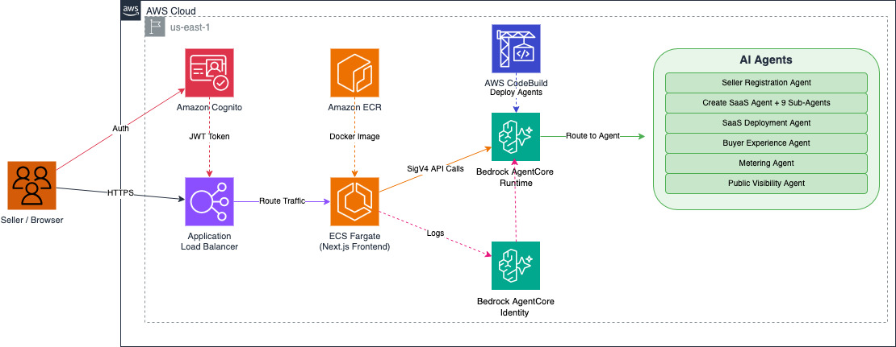

# AWS Marketplace QuickList

This sample demonstrates an AI-powered portal that **guides AWS Partners through the end-to-end process of becoming an AWS Marketplace seller, from registration to SaaS-based product listing creation.** It uses a Next.js frontend hosted on ECS Fargate behind an Application Load Balancer with Cognito authentication, and a set of specialized AI agents running on Amazon Bedrock AgentCore Runtime — including agents for seller registration, SaaS product creation, deployment, buyer experience, metering, and public visibility — all deployed via AWS CodeBuild and backed by Amazon Bedrock (Claude) for intelligent, conversational assistance.

For a hands-on walkthrough, see the [AWS Marketplace Seller Workshop](https://catalog.workshops.aws/mpseller/en-US/pre-requisite-register-as-seller).



## Quick Start

### Prerequisites

- AWS CLI configured with credentials
- Python 3.10+ with venv
- AgentCore CLI — **latest version required** (`pip install --upgrade bedrock-agentcore`)
- No Docker required — builds happen via AWS CodeBuild

### Deploy

```bash
python3 -m venv venv
source venv/bin/activate
pip3 install -r requirements.txt
./deploy.sh
```

This deploys:
1. **Backend**: Python agents to Amazon Bedrock AgentCore Runtime (ARM64 via CodeBuild)
2. **Frontend**: Next.js to ECS Fargate with ALB + Cognito authentication (AMD64 via CodeBuild)

### Options

```bash
./deploy.sh --skip-backend   # Deploy frontend only
./deploy.sh --skip-frontend  # Deploy backend only
```

### Post-Deploy: Create a User

The ALB is protected by Cognito. Create a user to log in:

```bash
aws cognito-idp admin-create-user \
  --user-pool-id <pool-id-from-deploy-output> \
  --username your@email.com \
  --user-attributes Name=email,Value=your@email.com \
  --temporary-password 'TempPass1!' \
  --region us-east-1
```

Then open the ALB URL from the deploy output — you'll set a permanent password on first login.

## Configuration

| Variable | Description |
|---|---|
| `AGENTCORE_RUNTIME_ARN` | Auto-set by deploy script |
| `AWS_REGION` | Default: `us-east-1` |

## Architecture

- **Frontend**: Next.js on ECS Fargate (AMD64)
- **Backend**: Python agents on Amazon Bedrock AgentCore (ARM64)
- **AI**: Amazon Bedrock (Claude) for intelligent assistance
- **Auth**: Cognito User Pool on ALB (HTTPS listener with authenticate-cognito action)
- **Networking**: Separate ALB/ECS security groups, VPC endpoints for AWS services

## Local Development

```bash
# Backend
cd backend && pip install -r ../requirements.txt && uvicorn main:app --reload

# Frontend
cd frontend && npm install && npm run dev
```

## Cleanup

```bash
aws ecs delete-service --cluster ai-agent-marketplace --service ai-agent-marketplace --force --region us-east-1
aws elbv2 delete-load-balancer --load-balancer-arn $(aws elbv2 describe-load-balancers --names ai-agent-marketplace-alb --query "LoadBalancers[0].LoadBalancerArn" --output text --region us-east-1) --region us-east-1
```

## Notes

- This lab uses pre-built assets for a simple deployment in the N. Virginia (us-east-1) AWS Region. For any customization or deployments to other Regions, you must re-build it from the source in [aws-samples/aws-marketplace-serverless-saas-integration](https://github.com/aws-samples/aws-marketplace-serverless-saas-integration) GitHub repository.
- The solution created in this lab serves as a reference demonstrating the core components needed for integrating and operating a SaaS listing in AWS Marketplace. While we periodically update the solution to reflect current integration standards, it does not adhere to any service level agreement. Proceed with caution if you intend to use this solution in your production accounts, or on production or other critical data. You are responsible for testing, securing, and optimizing AWS Content, such as sample code, as appropriate for production grade use based on your specific quality control practices and standards.

## License

See [LICENSE](LICENSE) file.
