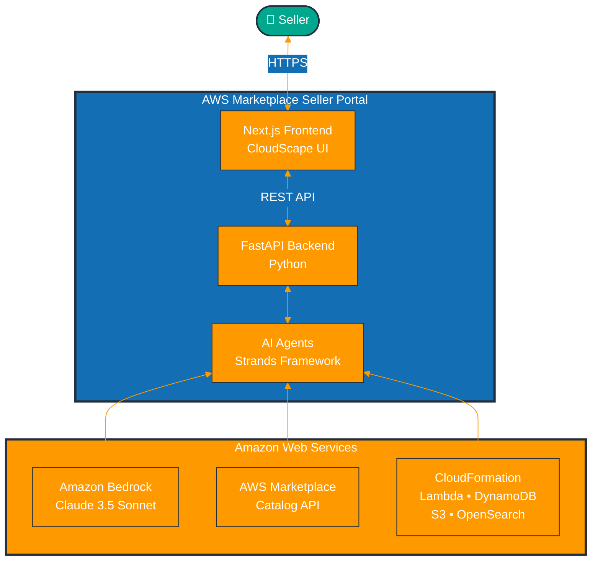
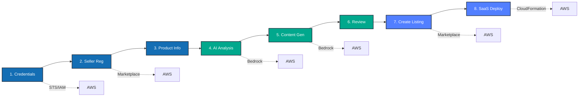

# Architecture Banner

This document contains the architecture diagrams that can be embedded in presentations and documentation.

## System Overview

## 7-Stage Workflow

## Technology Stack

| Layer | Technologies |
|-------|-------------|
| **Frontend** | Next.js 14, React 18, TypeScript, CloudScape, Zustand |
| **Backend** | FastAPI, Python 3.13, Uvicorn, Pydantic, Boto3 |
| **AI/ML** | Amazon Bedrock (Claude 3.5), Strands Agents |
| **AWS** | Marketplace, CloudFormation, Lambda, DynamoDB, S3, OpenSearch, IAM, CloudWatch |
| **Future** | Bedrock AgentCore (Runtime, Gateway, Memory, Identity, Tools, Observability) |
