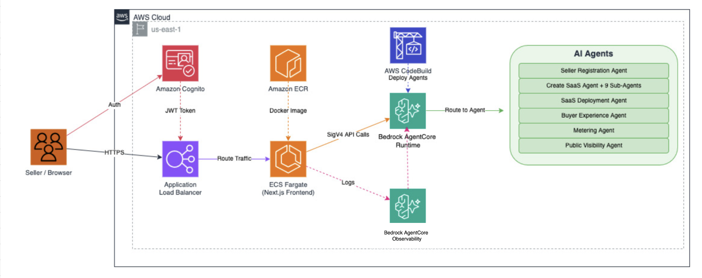

# Design Document — AI Agent Marketplace

## Overview

The AI Agent Marketplace is a multi-component application that helps AWS Partners list, configure, and manage SaaS products on AWS Marketplace. It uses Amazon Bedrock-powered agents to guide sellers through the listing workflow.

## Architecture

## Components

- Frontend: Next.js application served via Amazon ECS on AWS Fargate behind an ALB with Amazon Cognito authentication.
- Backend: Python-based agents running on Amazon Bedrock AgentCore Runtime, orchestrating the listing workflow.
- Storage: Amazon DynamoDB for session/agent memory, Amazon S3 for knowledge base documents.

## Security Considerations

- All traffic to the ALB is authenticated via Amazon Cognito User Pool.
- HTTP is redirected to HTTPS; self-signed ACM certificate used for internal deployments.
- ECS tasks run in a security group that only accepts traffic from the ALB security group on port 3000.
- VPC endpoints are provisioned for Amazon ECR, Amazon S3, Amazon CloudWatch, Amazon Bedrock, and AWS STS to minimize public internet exposure.
- IAM roles follow least-privilege: scoped actions instead of FullAccess managed policies.
- S3 buckets enforce Block Public Access, SSE-KMS encryption, and TLS-only bucket policies.
- No secrets or credentials are stored in source code; all sensitive values come from environment variables or AWS IAM roles.
- User-provided URLs are validated (HTTPS-only, no private IPs) before fetching to prevent SSRF.
- The backend binds to 127.0.0.1 by default; 0.0.0.0 binding requires explicit opt-in via environment variable.

## Data Flow

1. User authenticates via Amazon Cognito and accesses the frontend.
2. Frontend calls backend API endpoints which delegate to specialized agents.
3. Agents interact with Amazon Bedrock for AI-powered content generation and guidance.
4. Agents call AWS Marketplace Catalog API to create/manage listings.
5. SaaS integration agent deploys AWS CloudFormation stacks for fulfillment infrastructure.
6. Session state is persisted in Amazon DynamoDB with TTL-based expiration.
